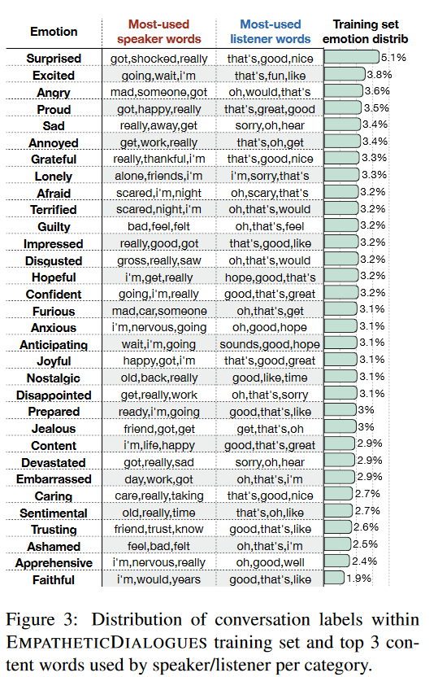

# Empathetic Dialogues Dataset

## Subtask 1 of 3 – Basic Information

- **The Name of the Dataset**  
  My chosen dialogue dataset’s name is the Empathetic Dialogues dataset. 

- **What Kind of Data It Is (Domain, Modality)**  
  It is a dataset of 25,000 (25 thousand) one-to-one conversations prompted by given emotion labels. Since these conversations are written, the dataset’s modality is textual. The dataset’s domain is empathetic conversations occurring during emotional, personal situations.

- **Where You Downloaded It From (Include the Original URL)**  
  The dataset is publicly accessible from the following URL: [https://github.com/facebookresearch/EmpatheticDialogues](https://github.com/facebookresearch/EmpatheticDialogues).

- **How It Was Collected**  
  This dataset was collected through crowdsourcing using the ParlAI platform. 810 US citizens were hired to partake in one-to-one conversations about personal situations covering a balanced and large set of 32 emotions. Each dialogue was grounded in a specific experience where one of the participants (speaker) had felt or was feeling at that moment/period of her/his life a pre-defined emotion, and the other participant (listener) was responding to that emotional experience; the interlocutors had to exchange up to six turns. More specifically, all emotions were first given to each participant, who briefly described a personal situation related to each of them. Then the participants were paired, and one of them was given one emotion label (e.g., ‘Joyful’) in order to elaborate on the situation s/he had related to that emotion previously; in this way, the speaker was primed to expand on that personal situation. The listener’s role was to respond empathetically to the speaker’s story solely based on cues from the actual conversation, and without knowing the priming emotion nor the speaker’s initial, brief situation description.

- **What Kind of Dialogue System or Dialogue System Component It's Designed For**  
  The dataset was intended for empathetic dialogue generation, that is to make generic chit-chat conversation systems more empathetic. Indeed, as the authors of the original paper claim, dialogue models that use this specific dataset for their training are evaluated as more empathetic by humans compared to dialogue models trained without this dataset, and just on large conversation data from the Internet. The authors, also, remark that their ultimate goal was to train a model for conversation that can respond to any emotion.

- **What Kind of Annotation Is Present (If Any at All), How Was It Obtained (Human/Automatic)**  
  The annotation present in the dataset involves a broad range of 32 emotions, both positive and negative. The emotion labels are found under the ‘context’ column of each csv file. The researchers chose the emotions manually by aggregating labels from several emotion prediction datasets.

- **What Format It Is Stored In**  
  The downloaded folder ‘empatheticdialogues’ contains three files each file containing a training, a validation, and a test dataset; these files are stored in csv format (i.e., train.csv, valid.csv, test.csv).

- **What the License Is**  
  The Empathetic Dialogues dataset is licensed under the "Creative Commons Attribution-NonCommercial 4.0 International Public License" license (CC BY-NC 4.0), which is part of the Creative Commons framework. Under this license, users are free to “copy and redistribute the material in any medium or format” as well as to “remix, transform, and build upon the material” while giving appropriate credit, providing a link to the license, and indicating if changes were made; also, users “may not use the material for commercial purposes” (taken from [Creative Commons License](https://creativecommons.org/licenses/by-nc/4.0/deed.en)).

## Subtask 2 of 3 - Measurements

- **Total Data Length (In Terms of Dialogues, Turns, Sentences, Words; Separately for User/System)**  
  I have inspected the training set, as per the instructions of this subtask. According to a basic inspection of the train.csv file, it contains 76,668 rows and 8 columns. The column names are the following:
  1. conv_id: The conversation identifier (e.g., hit:0_conv:1).
  2. utterance_idx: The index of the utterance/turn within the conversation (e.g., 1, 2, 3 up to 8, which was the maximum number of turns in a conversation).
  3. context: The context of the conversation (e.g., sentimental, afraid, etc.).
  4. prompt: The prompt of the conversation (e.g., I remember going to the fireworks with my best friend. There was a lot of people, but it only felt like us in the world.).
  5. speaker_idx: The index of the participant in the conversation (e.g., 0, 1, 2 up to 853. Note: This is problematic, because this means there were 854 participants although the original paper mentions 810 participants). Each participant took part not only in one conversation, but minimum in 2 and maximum in 2,808 conversations.  
  6. utterance: The actual text written by each participant.
  7. selfeval: Self-evaluation metrics on empathy, relevance, and fluency of the listener’s response by human evaluations who were asked to rate the performance of the dialogue models on the Empathetic Dialogue task (e.g., 5|5|5).
  8. tags: Additional tags (e.g., <UNIGRAM>, <NUMERAL>, but mostly NaN/null values).

- **Total Length**
  | Description                                             | Total Length  |
  |---------------------------------------------------------|---------------|
  | Dialogues/Conversations (calculated from 'conv_id')     | 17,839        |
  | Turns                                                   | 76,668        |
  | Sentences (calculated from ‘utterance’, not ‘prompt’)   | 132,934       |
  | Words (ibid.)                                           | 1,446,157     |

  
- **Mean/Std Dialogue Lengths (In Terms of Dialogues, Turns, Sentences, Words; Separately for User/System)**
  | Category                  | Mean/Std      |
  |---------------------------|---------------|
  | Conversations per emotion | 557 ± 95      |
  | Turns per conversation    | 4 ± 1         |
  | Sentences per turn        | 2 ± 7         |
  | Words per turn            | 19 ± 208      |

- **Vocabulary Size (Separate for User/System)**  
  After lowercasing, tokenizing, and lemmatizing the ‘utterance’ column, the resulting vocabulary size of unique words amounts to 16,085.

## Subtask 3 of 3 - Impressions

- **Does the Data Look Natural?**  
  The dialogues in the training dataset are written in the English language, and they seem natural and fluent enough for casual chit-chat done by real humans. I inspected 178 turns, as a random 1% sample of the original 17,839 dialogues, and I have noticed the following natural language features:
  - The use of informal words and expressions like “Yeah”, “lol”, “oh man”, etc.; 
  - The use of capitalization for emphasis like “LOL”, “It is a GOOD day”, “I LOVE EGGPLANT!”, etc.
  - The use of sloppy grammar like “kids keep egging my car!”, “in a couple weeks”, “Ive been there.”, “Thats interesting.”, etc. 
  - Spelling mistakes that are to be expected from someone who types fast or carelessly like “My pants feel down while at church today.” (instead of “fell down”), “did you play with toys alot at a kid” (instead of “a lot” and “as a kid”), “i agree with you!” (instead of “I agree with you!”), etc.

- **How Difficult Do You Think This Dataset Will Be to Learn From?**  
  The dataset seems to be poor for immediate use as input for a machine learning task, even though it exhibits natural speech by humans relevant to the task of responding empathetically to personal experiences, as proven above. The reasons I am supporting the view that this dataset is poor are:
  - The emotion labels (i.e., classes) are not quite balanced, even though the authors claim they are balanced in the original paper (see below Fig. 3, p. 3):
    

      
    

  - The reason I am supporting the view that the dataset is not quite balanced is that some emotions are under-represented. These emotions are “trusting”, “ashamed”, “apprehensive”, and “faithful”, and are present at the bottom 10th percentile of the distribution with a frequency equal to half of the emotion “surprised”. Conversely, we can conclude that the “surprised” emotion is over-represented.
  - There are some serious mistakes with respect to the structure of the dataset, in particular regarding the number of sentences per utterance as well as the number of words per utterance sentence. First, I will analyze the number of sentences per utterance. When viewing the variable ‘sentence_counts’, which includes the total number of sentences in the ‘utterance’ column, we notice that apart from the reasonably small integers (like 1, 2, 3, and 4) there are some too large values like 166, 109, etc. Upon closer inspection, it becomes evident that sometimes several conversations have been wrongly concatenated together, so that dialogues from different conversation IDs (together with their ‘conv_id’, ‘context’, and ‘prompt’ columns) are all mixed up in a single utterance. This accumulation of whole conversations into a single utterance constitutes a serious concern about the quality of the dataset, which impacts any statistical analysis or model training performed on this data. Next, I will analyze the number of words per utterance. Similarly, when viewing the variable ‘word_counts’, which includes the sum of words in every sentence of every utterance, we notice that apart from the reasonable numbers (like 41, 15, 10, etc.) there are some too large values like 2,155 or 13,102, which seem unreasonable. Upon closer inspection, once again it becomes evident that different conversations are mixed together within a single 'utterance', as was shown before. This mixing up of various conversations into one utterance causes the word counts to be unreasonably large, since entries of multiple conversations are erroneously counted as being sentences of one utterance in the ‘utterance’ column.

- **How Usable Will it Be In an Actual System?**
  The present Empathetic Dialogues dataset does contain relevant conversations by human interlocutors, but due to certain significant issues described in detail below, I do not believe it is immediately usable to train an actual dialogue system.

- **Do You Think There's Some Kind Of Problem Or Limitation With The Data?**
  I have discovered that there are some serious problems concerning the quality of the training dataset. Indeed, there exist problems concerning the structure of the ‘utterance’ columns that severely influence the statistics of the sentence and word counts, as well as any potential model training. As seen in the Mean/Std Lengths table, the problem lies with the occasional wrong conversation boundaries, where various conversation IDs are falsely incorporated into one and only ‘utterance’ column of another conversation ID, with the result that whole rows of a conversation ID (together with their columns and their respective text/values) are found under one ‘utterance’ column. 
Furthermore, I believe there may be some bias with respect to some emotions, since a certain emotion is over-represented (“surprised”), and others are under-represented (“trusting”, “ashamed”, “apprehensive”, and “faithful”). The view that this constitutes bias in the training dataset is, of course, based on the assumption that the unequal representation of emotions does not truthfully represent how emotion is actually distributed across the population. Should the opposite be true, i.e. the emotions depicted are an actual representation of the population, the unequal representation is something that needs to be left as is.
In conclusion, to be able to make use of the present dataset for dialogue system training, a thorough review and manual separation of the mixed conversation IDs are required. Also, depending on the assumptions made, one must decide whether to keep the unequal emotion-representation or not.

## Bibliography
Rashkin, Hannah, et al. *Towards Empathetic Open-Domain Conversation Models: A New Benchmark and Dataset.* arXiv, Cornell University, 28 Aug. 2019, [arxiv.org/abs/1811.00207](arxiv.org/abs/1811.00207). [Accessed on 2 Dec 2023]
